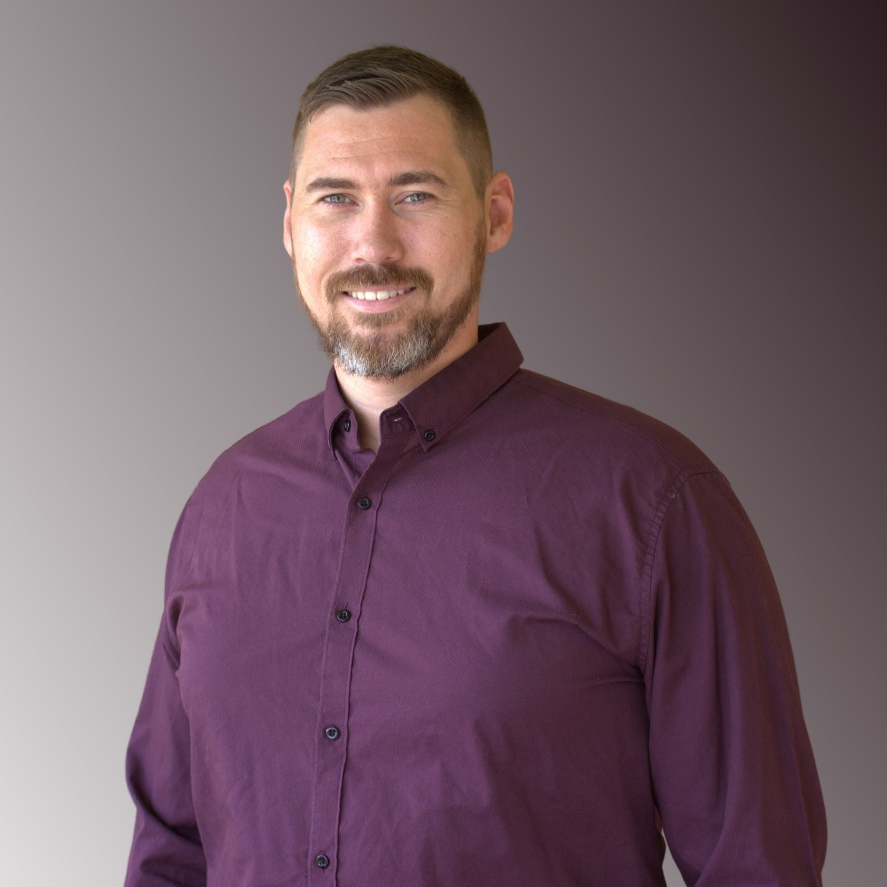

# Ben Lewis

## Contact

**Location:** Adelaide, SA  

| `</>` | 📧 | 💼 |
|-------|----------|--------|
| [GitHub](https://github.com/benLewisDev) | [Ben_Lewis_91@hotmail.com](ben_lewis_91@hotmail.com) | [LinkedIn](https://linkedin.com/in/benlewis91) |

---

# Professional Summary

AWS Certified Solutions Architect and Cloud Engineer.

Experience designing, implementing and supporting secure cloud platforms for Government and Enterprise clients across Defence, Cyber Security and Digital Health Environments.

Skilled in AWS cloud-native services, Infrastructure as Code, platform engineering, Linux administration and DevOps practices. Hands-on experience delivering cloud migration, automation and operational support using Terraform, Kubernetes, Docker and Git-based workflows.

Former Australian Army Reserve Corporal with proven leadership, operational planning and stakeholder engagement skills, bringing a disciplined, adaptable and solutions-focused approach to complex technical environments.

---

# Certifications

- **AWS Certified Solutions Architect – Associate** – AWS (2023)
- **AWS Certified Cloud Practitioner** – AWS (2024)
- **Microsoft Certified: AZ-900 Azure Fundamentals** – Microsoft (2023)

---

# Technical Skills

| Category | Technologies |
|----------|--------------|
| **Cloud Platforms** | AWS (EC2, RDS, Lambda, CloudFormation, CloudWatch, CodeCommit, ElastiCache, Athena), Microsoft Azure |
| **Infrastructure as Code** | Terraform, AWS CloudFormation |
| **Containers & Orchestration** | Docker, Docker Compose, Kubernetes |
| **Operating Systems** | Linux (RHEL), Windows, VMware |
| **Version Control & CI/CD** | Git, GitLab, AWS CodeCommit |
| **Programming & Scripting** | Python, Bash, SQL, JavaScript, HTML, CSS |
| **Databases** | Amazon RDS, SQL, Amazon Athena |
| **Monitoring & Operations** | Amazon CloudWatch, Incident Management, Production Support, System Monitoring |
| **Engineering Practices** | Platform Engineering, Infrastructure Automation, Cloud Migration, Software Factory, Technical Documentation, Secure Development, Stakeholder Engagement |

---

# Relevant Experience

## Cloud & Engineering Senior Consultant – AWS Platform Engineering
**Deloitte**  
*May 2023 – Jul 2026*

### Project: Confidential Government Client

Architected and delivered a secure AWS cloud-native software factory that enabled secure, scalable and repeatable application delivery.

- Designed and implemented an AWS software factory using cloud-native services.
- Led migration of an enterprise application from on-premises to AWS.
- Developed Infrastructure as Code using Terraform to provision and manage AWS services including EC2, RDS, Lambda and ElastiCache.
- Administered Linux (RHEL) environments and automated infrastructure deployment.
- Produced Secure Environment Design (SED) and technical documentation while working with stakeholders to achieve security and governance approvals.
- Established Git-based engineering standards and version control practices to support collaborative software development.

### Project: Confidential Government Cyber Security Platform

Provided AWS platform engineering support for a large-scale government-led cyber security platform supporting multiple enterprise clients.

- Supported production AWS infrastructure, Kubernetes workloads and Linux systems.
- Onboarded new client environments through technical implementation and stakeholder engagement.
- Worked with EC2, Lambda, CloudWatch, Athena, CloudFormation and SQL.
- Investigated and resolved production incidents to maintain platform availability and performance.

---

## Consultant
**WithYouWithMe (WYWM)**  
*May 2021 – May 2023*

### Project: Production Operations (Level 2 Reporting) – Accenture Australia

Supported business-critical production systems for the Australian Digital Health Agency, ensuring the reliable delivery of My Health Record reporting services.

- Investigated production issues across Linux, SQL and VMware environments.
- Delivered operational reporting and technical investigations for government stakeholders.
- Worked within ITIL incident, problem and change management processes.

### Project: Pega System Architect – Brumby Systems

Designed and implemented proof-of-concept software solutions for government clients within Agile delivery teams.

- Developed proof-of-concept applications using the Pega Platform.
- Collaborated with technical and business stakeholders.
- Researched new technologies and shared knowledge across the team.

---

## Corporal – Light Cavalry Scout
**Australian Army Reserve (NSW & SA)**  
*Jul 2014 – May 2023*

Delivered leadership, communications and operational support within the Australian Army Reserve, leading small teams in high-pressure environments requiring teamwork, discipline and sound decision-making. Operated secure communications systems in accordance with Defence security requirements and planned field activities involving risk assessment, situational awareness and effective decision-making.

---

## Deployment Engineer
**DXC – Defence Protected Network Rollout**  
*Feb 2017 – Dec 2017*

Supported the nationwide rollout of the Defence Protected Network, delivering secure endpoint deployments and infrastructure upgrades across Defence sites throughout New South Wales while adhering to Defence security procedures.

---

## Looking Ahead
*Now - Forever*

Technology is one of those fields where there's always something new to learn, and that's exactly what keeps me interested. I have an insatiable curiosity and tech is a space that allows me to feed that hunger for knowledge.

I'm looking forward to building more things, exploring new ideas, contributing back through open source, and finding a place where I can grow alongside a great team. Along the way, I'd also like to spend more time mentoring junior engineers and helping others find their footing in the industry.
