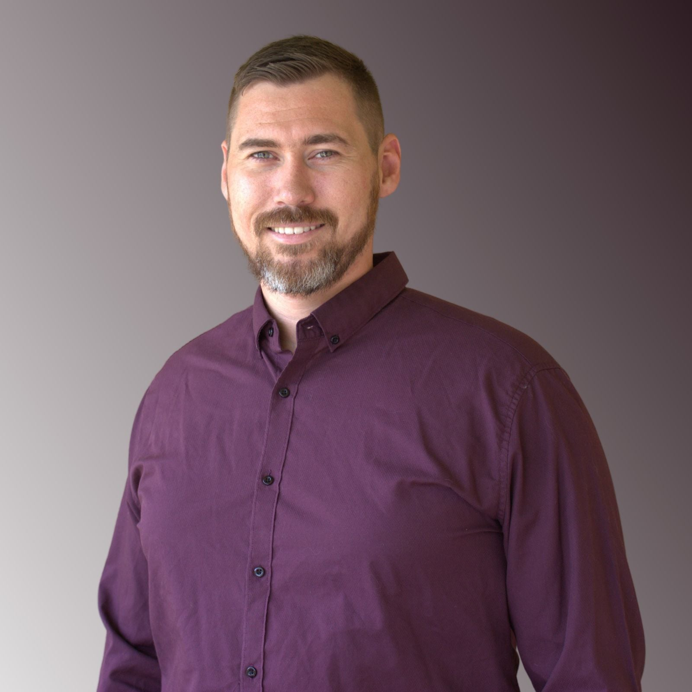

# Ben Lewis

  

<h2 align="center">Contact</h2>

  <a href="https://github.com/benLewisDev" class="contact-item">
    <code>&lt;/&gt;</code>
    GitHub
  </a>

  <a href="https://linkedin.com/in/benlewis91/" class="contact-item">
    💼
    LinkedIn
  </a>

  <a href="mailto:ben_lewis_91@hotmail.com" class="contact-item">
    ✉️
    Email
  </a>

  <a href="https://github.com/benLewisDev/resume/tree/main/resume-documents" class="contact-item">
    📄
     Download Resume
  </a>

---

# Professional Summary

AWS Certified Solutions Architect and Cloud Engineer.

Experience delivering secure cloud platforms, Infrastructure as Code, Linux administration, and production support across government, Defence, and enterprise environments.
Strong background in AWS, Terraform, Kubernetes, automation, incident response, and stakeholder collaboration, with a disciplined, solutions-focused approach to reliable, secure, and highly available operations.
Former Australian Army Reserve Corporal with proven leadership, operational planning and stakeholder engagement skills, bringing a disciplined, adaptable and solutions-focused approach to complex technical environments.

---

# Certifications

- **AWS Certified Solutions Architect – Associate** – AWS (2024)
- **AWS Certified Cloud Practitioner** – AWS (2023)
- **Microsoft Certified: AZ-900 Azure Fundamentals** – Microsoft (2023)

---

# Technical Skills

| Category | Technologies |
|----------|--------------|
| **Cloud Platforms** | AWS (EC2, RDS, Lambda, CloudFormation, CloudWatch, CodeCommit, ElastiCache, Athena), Microsoft Azure |
| **Infrastructure as Code** | Terraform, AWS CloudFormation |
| **Containers & Orchestration** | Docker, Docker Compose, Kubernetes |
| **Operating Systems** | Linux (RHEL), Windows, VMware |
| **Version Control & CI/CD** | Git, GitLab, AWS CodeCommit |
| **Programming & Scripting** | Python, Bash, SQL, JavaScript, HTML, CSS |
| **Databases** | Amazon RDS, SQL, Amazon Athena |
| **Monitoring & Operations** | Amazon CloudWatch, Incident Management, Production Support, System Monitoring |
| **Engineering Practices** | Platform Engineering, Infrastructure Automation, Cloud Migration, Software Factory, Technical Documentation, Secure Development, Stakeholder Engagement |
| **Soft Skills** | Excellent Communication, Cross-functional collaboration, Problem-solving, Willingness to learn, Self-direction, Adaptability, Technical communication, Teamwork, Initiative, Ownership and Accountability |

---

# Relevant Experience

## Cloud & Engineering Senior Consultant – AWS Platform Engineering
**Deloitte**  
*May 2023 – Jul 2026*
While at Deloitte, I contributed to multiple government programmes, delivering secure cloud and infrastructure solutions for nationally sensitive environments. My work focused on designing and engineering systems aligned with security frameworks such as ISM controls and Essential Eight requirements, with an emphasis on compliance, resilience, and operational integrity. 

### Project: Confidential Government Client

Architected and delivered a secure AWS cloud-native software factory that enabled secure, scalable and repeatable application delivery.

- Led the migration of two legacy enterprise applications from on-premises to AWS, improving service reliability, reducing downtime, and strengthening operational resilience.
- Engineered Infrastructure as Code with Terraform to provision and manage AWS services such as EC2, RDS, Lambda, and ElastiCache, improving automation, repeatability, and platform scalability.
- Produced Secure Environment Design (SED) and technical documentation while collaborating with stakeholders to secure governance and security approvals, supporting controlled delivery and operational readiness.
- Established Git-based version control practices and engineering standards to support collaborative development, deployment consistency, and continuous improvement.

### Project: Confidential Government Cyber Security Platform

Provided AWS platform engineering support for a large-scale government-led cyber security platform supporting multiple enterprise clients.

- Maintained production AWS infrastructure, Kubernetes workloads, and Linux systems to support high availability, operational stability, and secure service reliability.
- Administered 10+ Linux RHEL environments and automated infrastructure deployment, reducing operational risk and supporting stable production service delivery.
- Onboarded new client environments through technical implementation and stakeholder engagement, improving adoption, reducing friction, and supporting scalable platform delivery.
- Worked with EC2, Lambda, CloudWatch, Athena, CloudFormation and SQL.
- Investigated, managed, and resolved production incidents to maintain platform availability, performance, and recovery outcomes.

---

## Consultant
**WithYouWithMe (WYWM)**  
*May 2021 – May 2023*
At With You With Me, I made the first major transition into a technology career, contributing to business-critical production support for the Australian Digital Health Agency’s My Health Record reporting services, as well as designing and implementing proof-of-concept software solutions for a startup serving government clients. 

### Project: Production Operations (Level 2 Reporting) – Accenture Australia

Supported business-critical production systems for the Australian Digital Health Agency, ensuring the reliable delivery of My Health Record reporting services

- Investigated production issues across multiple environments, facilitating restoration of service, resolving incidents, and maintaining platform stability.
- Delivered operational reporting and technical investigations for government stakeholders, improving system visibility and supporting faster operational decisions.
- Worked within incident, problem, and change processes to ensure controlled service restoration and reduce operational risk.

### Project: Pega System Architect – Brumby Systems

Designed and implemented proof-of-concept software solutions for government clients, contributing to Agile software development projects and supporting continuous improvement within the development team.

- Designed and implemented proof-of-concept software solutions for government clients, validating technical approaches and supporting Agile delivery and continuous improvement.
- Collaborated within Agile delivery teams and with technical and business stakeholders to deliver proof-of-concept solutions aligned to client needs and project outcomes.
- Researched new technologies and shared knowledge across the team, contributing to capability uplift and more effective delivery.

---

## Corporal – Light Cavalry Scout
**Australian Army Reserve (NSW & SA)**  
*Jul 2014 – May 2023*

Delivered leadership, communications and operational support within the Australian Army Reserve, leading small teams in high-pressure environments requiring teamwork, discipline and sound decision-making. Operated secure communications systems in accordance with Defence security requirements and planned field activities involving risk assessment, situational awareness and effective decision-making.

---

## Deployment Engineer
**DXC – Defence Protected Network Rollout**  
*Feb 2017 – Dec 2017*

Supported the nationwide rollout of the Defence Protected Network, delivering secure endpoint deployments and infrastructure upgrades across Defence sites throughout New South Wales while adhering to Defence security procedures.

---

# EARLIER EXPERIENCE

## Security Operations
**Commander Security Services, Security Specialists Australia**
*March 2015 – May 2017*
Performed cash-in-transit and static security duties across client sites, working within strict security procedures and time-critical collection schedules. Liaised with business owners to coordinate secure banking collections, handled and reconciled large cash amounts, completed daily reports and returns, and used radio communications in accordance with company SOPs. Developed strong situational awareness, attention to detail, teamwork, safe vehicle operation, and experience training new staff.

## Automotive Parts Interpreter
**JJ Autoparts & Riverside Spares**
*October 2011 – September 2014*
Worked in automotive spare-parts environments providing parts interpretation, sales and customer support, stock-related assistance, and delivery services. Built practical experience identifying customer requirements, communicating clearly with customers and suppliers, managing competing priorities, and maintaining accuracy in a fast-paced setting. Also supported yard operations, vehicle dismantling, deliveries, and staff training.

## Looking Ahead
*Now - Forever*

Technology is one of those fields where there's always something new to learn, and that's exactly what keeps me interested. I have an insatiable curiosity and tech is a space that allows me to feed that hunger for knowledge.

I'm looking forward to building more things, exploring new ideas, contributing back through open source, and finding a place where I can grow alongside a great team. Along the way, I'd also like to spend more time mentoring junior engineers and helping others find their footing in the industry.

---
<h4 align="center">Thanks for reading</h4>

If you'd like to connect or chat about cloud engineering, feel free to reach out.

Ben Lewis • AWS Certified Solutions Architect • Adelaide, SA

